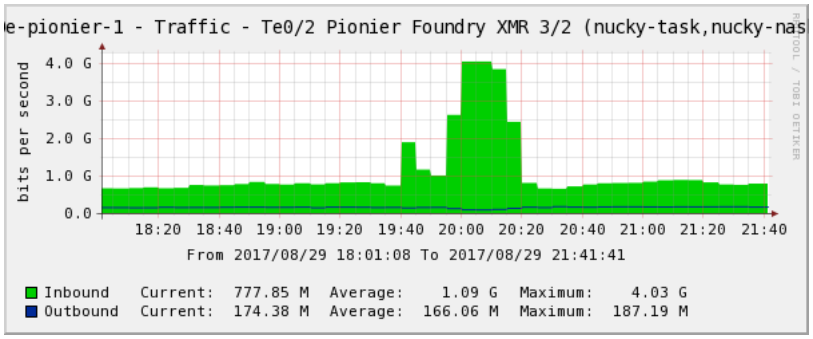

# Bezpieka

## 1. Koncepcja triady bezpieczeństwa oraz innych usług ochrony informacji

### Concept of Confidentiality, Integrity and Availability

- Confidentiality (Poufność)
    - Dane i usługi powinny być dostępne tylko dla uprawnionych osób
    - Dane powinny być chronione w trakcie przechowywania, przetwarzania i transmisji
    - __Możliwe ataki__: przechwycenia ruchu sieciowego, kradzież haseł (socjotechniki), skanowanie portów,  (podsłuchiwanie), [sniffing](https://pl.wikipedia.org/wiki/Sniffer)
    - __Formy ochrony__: Dostępu do kont chronią nazwy użytkowników, hasła, wielostopniowe uwierzytelnianie, trasmisja danych jest szyfrowana, personel jest dobrze przeszkolony
    - Uwierzytelnianie (Authentication) - potwierdzenie tożsamości
    - Autoryzacja (Authorization) - potwierdzenie uprawnień
    - Secrecy - Secrecy is the act of keeping something a scret or preventing the disclosure of information
    - Privacy - refers to keeping information confidential that is personally identifiable or that might couse harm, embarrassment or disgrace to someone

- Integrity (Integralność)
    - Dane i usługi powinny być nienaruszone przez podmioty, które nie mają do nich uprawnień
    - Wysoki poziom pewności, że dane zostały niezmienowe przez nieuprawniony podmiot (w trakcie przechowywania, przetwarzania i transmisji)
    - 3 perspektywy integralności
        - Powstrzymanie nieuprawnionego użytkownika przez modyfikacją danych
        - Powstrzymanie uprawnionego użytkownika przez nieuprawnioną modyfikacją danych
        - Utrzymanie wewnętrznej i zewnętrzej spójności danych, tak aby były odzwierciedleniem prawdziwego świata
    - __Możliwe ataki__: wirusy, backdoors, błędy użytkowników [PEBCAC](https://en.wiktionary.org/wiki/PEBCAC#English), przypadkowe usunięcie danych, wprowadzenie niepoprawnych danych, złośliwe modyfikacje
    - __Formy ochrony__: regorystyczna kontrola dostępu, regorystyczne procedury uwierzytelnienia użytkowników, systemy wykrywania intruzów, szyfrowanie danych, szkolenie personelu

- Availavility (Dostępność)
    - Każda uprawniona osoba powinna mieć dostęp do zasobów
    - Odporność na ataki DOS
    - __Możliwe ataki__: awarie urządzeń, oprogramowania, problemy ze środowiskiem (powódź, awaria zasilania), ataki DOS itp.
    - __Formy ochrony__: monitorowanie wydajności i ruchu sieciowego, używanie firewall-i i routerów w celu zapobiegania atakom DOS, redundacja dla krytycznych części systemu (dodatkowe łącze internetowe, generator prądu), system backupów
    - Nonrepudiation (niepodważalność) - zapewnienie, że osoba upoważniona nie otrzyma "odmowy dostepu". Pełną niepodważlność uzyskujemy poprzez wykorzystanie certyfikatów

### Access Control

- Access is the flow of information between a subject(e.g., user, program, process, or device, etc.) and an object (e.g., file, database, program, process, or device, etc.)
- Jest to zestaw mechanizmów, które razem zapewniają ochronę danych przez nieuprawnionym dostępem
- Kontrola dostępu uprawnia do zażądzania
    - Jacy użytkownicy maja mieć dostęp do systemu
    - Jakie zasoby maja być dostępne`
    - Jakie operację mogą być wykonane
    - Dostarcza indywidualną odpowiedzalność // mam wrażenie że chodzi tutaj o to, że każdy użytkownik jest niezależny i może mieć indywidualny zakres uprawnień
- Implementacje
    - _Least privilege_ - ograniczenie uprawnień użytkowników do niezbędnego minimum
    - _Separate od duties_ - proces jest tak zaprojektowany, że jego kroki muszą być wykonane przez róźne osoby (róźne uprawnienia)
- Kategorie kontroli bezpieczeństwa
    - _Management_ - polityki, standardy, procesy, procedury
    - _Operational (and Physical) Controls_ - przestrzeganie procedur, edukacja i świadomość
        - _Physical Security_ - zamki, drzwi, ochrona itp.
    - _Technical Controls_ - Kontrola dostępu, Identyfikacja i uwierzytelnienie, poufność, integralność, dostępnośc i niepodważalność

## 2. Zagrożenia na protokoły sieciowe warstwy 2 i 3 modelu OSI 🏮

### Data link layer protocols

- MAC (LAN & WAN)
- LLC (LAN)
- Ethernet (CSMA/CD)
- Token Ring (Token Passing)
- IEEE 802.11 a/b/g (CSMA/CA)
- WAN Data Link Layer
    - X.25
    - Frame Relay
    - SMDS (Switched Multi-gigabit Data Services)
    - ISDN (Integrated Services Digital Network)
    - HDLC (High-level Data Link Control)
    - ATM (Asynchronous Transfer Mode)
- SLIP (Serial Line Internet Protocol)
    - Kapsułkuje pakiet IP w jedną Serial line (linie szeregową ???)
    - Działa z różnymi protokołami (Token Ring, WAN)
    - Ale może działać tylko z jednym na raz
    - Nie sprawdza błędów transmisji danych
    - Nie zapewnia bezpieczeństwa
- PPP (Point-to-Point Protocol)
    - Mechanizm kapsułkujący do transportu wielo-protokołowych pakietów
    - Zastąpił SLIP bo może pracować z wieloma protokołami na raz i daje możliwośc uwierzytelnienia
    - Security:
        - PAP (Password Authentication Protocol)
            - Plain Text
        - CHAP (Challenge Handshake Authentication Protocol)
            - Chroni przez playback/replay atack używając 3-way handshake
        - EAP (Extensible Authentication Protocol)
            - Wspiera wiele mechanizmów uwierzytelnienia
            - MD5-Challange
            - One-Time Password
            - Generic Token Card
- WEP (Wired Equivalent Privacy)
    - Używa klucza symetrycznego o długości 40 bitów (jest opcja 104-bit, ale to nie standard) z 24 bitowym IV (Initialization Vector)
    - Używa tego samego statycznego klucza do wszytkich połączeń
    - Podatne na:
        - Haker może przechwycić wystarczającą ilość pakietów z takim samym IV i odkryć klucz symetryczny
        - Jeden statyczny, symetryczny klucz i rozmiarze 40 bitów
    - Lepsza wersja to WPA
        - Nie używa tego samego klucza do szyfrowania wszystkich połączeń
    - Jeszcze lepsa wersja WPA2
        - Używa IEEE 802.1X (np. EAP) do uwierzytelnienia
        - Używa 4-way handshake do zarządania kluczami
        - Używa AES-based CCMP (Counter-mode Cipher-block-chaining Message authentication code Protocol)
- EAP (Extensible Authertication Protocol)
- IEEE 802.1X
- ARP
    - Mapuje adresy IP na adresy MAC
    - Podatne na:
        - Man in the Middle
            - Przechwytywanie ruchu między dwoma urządzeniami w sieci
        - MAC Flooding Attack
            - Atak na switche
            - Zalewa switcha falą błędnych odpowiedzi ARP
            - Biedny switch przechodzi w tedy w tryb "hub", który umożliwia sniffowanie pakietów atakującemu
    - Można zapobiegać poprzez
        - Statyczne tablice ARP (nie skaluje się)
        - Uruchomienie sticky MAC address. Zapisuje wszystkie aktualnie posiadane adresy MAC, żeby móc je załadować po reboocie.

### IP Network Layer

- Logical Addressing: IP
- Controls: ICMP, ARP, RARP
- Routing
    - static
        - Najbezpieczniejszy
        - Skalowanie to porażka
    - dynamic
        - Skalowalny, ale wymaga utworzenia polityk bezpieczeństwa
        - Automatyczne się aktualizuje
- Routing  Protocols:
    - IGP's (Interior Gateway Protocols)
        - RIP - Routing Information Protocol
        - IGRP - Interior Gateway Routing Protocol
        - EIGRP - Enhanced IGRP
        - OSPF - Open Shortest Path First
        - IS-IS - Intermediate System to Intermediate System
    - EGP's (Interior Gateway Protocols)
        - EGP - Exterior Gateway Protocol - nie jest już używany
        - BGP - Border Gateway Protocol - standard routingu w Internecie
- NAT - metoda na podłączenie wielu komputerów do Internetu używając jednego adresu IP
    - Przyczyny użycia
        - Niedobór adresów IP
        - Bezpieczeństwo
        - Łatwość z zarządzaniu i administacją sieci

## 3. Zagrożenia na protokoły sieciowe warstwy 4 i 7 modelu OSI 🏮

- S-HTTP - eksperymentalny protokół stworzony do stosowania z HTTP
- HTTPS - to HTTP przez SSL
    - SSL działa na warstwie 4 (Transportowej)
    - Wiadomości HTTP są opakowywane przez SSL
- DNS (Domain Name System)
    - Tłumaczy nazwy domen na adresy IP
    - DNS server - dostarcza nazwy domen do zamiany na adresy IP
    - DNS resolver - Próbuje przetłumaczyć domenę na IP. Jeśli nie jest w stanie przesyła prośbę do następnego serwera DNS
    - __Możliwe ataki__
        - HOSTS poisoning (static DNS) - atakujący jest wstanie umieścić fałszywe informację w pliku HOSTS (siedzi w nim adresów IP z ich nazwami domenowymi)
        - Caching DNS server attacks - umieszczenie fałszywych informacji w cache-u DNS-a, za pośrednictwem innego DNS. Dzięki temu atakujący może zwrócić fałszywy adres IP dla strony.
        - DNS lookup address changing - zmiana adresu IP serwera DNS użytkownika na wybrany przez atakującego
        - DNS query spoofing - Atakujący przechwytuje zapytanie do serwera DNS i podstawia adres własnego serwera
        - 
    - __Zabezpieczenia__
        - Instalacja HIDS i NIDS - możliwość wykrycia ataku
        - Ustawienie wielu serwerów DNS
        - Aktualizowanie systemu
        - Regularne przeglądanie logów DNS i DHCP

## 4. Sieci VLAN, charakterystyka, zasady działania

- VLAN - Wirtualna Sieć Lokalna
- Dzieli jedną fizyczną sieć na kilka logicznych
- Komunikacja między dwoma sieciami jest możliwa tylko przez router
- Sieci wirtualne zachowują się tak jakby zostały stworzone przez osobne switche (a nie jeden)

### Rodzaje VLAN
- Statyczne
	- Porty na switchu sa konfigurowane statycznie przez admina
- Dynamiczne
	- Switch odpytuje specjalny serwer, który ustala do jakiej sieci VLAN przypisać dany port

- Istnieje możliwość przesyłania ramek między różnymi sieciami VLAN na poziome swicha. W tym celu można stworzyć oddzielne łącze zwykle określane jako __VLAN trunk__

### Głównym celem tworzenia sieci VLAN jest separacja ruchu sieciowego

## 5. Rodzaje zapór ogniowych: Static Packet-filtering firewall, Stateful inspection firewall, Proxy firewall

- Static Packet-filtering firewall
    - Działa na warstwie 3 (Network Layer)
    - Router ACL's - listy dostępu
    - Nie sprawdza warstw 4-7 przez co nie może chronić przed atakami na konkretne aplikacje
    - Polityka Firewall-a
        - Domyślnie blokuje, przepuszczas w drodze wyjątku

- Stateful inspection firewall (Dynamic)
    - Layer 3-4
    - Sprawdza stan i kontekst ruchu sieciowego
    - Jest szybszy niż proxy, bo sprawdza tylko protokół TCP/IP, nie sprawdza danych
    - Nie przepisuje wszystkich pakietów

- Proxy firewall (Application-level gateway firewall)
    - Sprawdza pakiety na poziomie warstwy aplikacji
    - Analizuje polecenia aplikacji w środku pakietu
    - Nie zezwala na żadne bezpośrednie połączenie
    - Kopiuje pakiety z jednej sieci do drugiej (zmienia source i destination)
    - Niegatywnie pływa na wydajność sieci
    - Wspiera uwierzytelnienie na poziomie użytkownika

## 6. Architektura zapór ogniowych: I, II, III Tier

### Single tier

- Sieci prywatne na firewallem
- przydatne tylko dla generycznych ataków
- minimalny poziom ochrony

### Two tier I

- Firewall z trzema lub więcej interfejsami

### Two tier II

- Dwa połączone firewall-e
- DMZ (demilitarized zone) - system musi być dostępny zarówno z sieci prywatnej jak i Internetu

### Three tier

- Wiele podsieci pomiędzy siecią prywatną a Internetem, rozdzielone firewall-ami


## 7. Systemy IDS i IPS: charakterystyka, metody detekcji, architektura. Honeypot

### IPS - Intrusion Preventing System

- Pełna kontrola pakietów
- umożliwia blokowanie ataków w czasie rzeczywistym
- Aktywne przechwytywanie i przekazywanie pakietów
- Kontrola dostępu i egzekwowanie polityki
- Zazwyczaj jest to urządzenie sieciowe
- Powstaje po połączenoi IDS-a z firewallem

### IDS - Intrusion Detection Systems

- Urządzenia/oprogramowanie do pasywnego monitoringu ruchu sieciowego w czasie rzeczywistym
- Network-based (N-IDS)
    - Pasywny monitoring i audyt przysyłanych pakietów
    - Analizują ruch w całej sieci
    - Potrafi wykrywać ataki z zewnątrz
    - Bazują na dopasowywaniu wzorców/sygnatur
        - Pattern/Signature Matching Method
            - Skanowanie pakietów w poszukiwaniu konkretnych sekwencji bitów
            - Identyfikacja znanych ataków
            - Wymaga regularnych aktualizacji sygnatur
        - Stateful Matching Method (śledzi pakiety w dłuższym okresie)
            - Skanuje cały strumień danych zamiast pojedynczych pakietów
            - Identyfikacja znanych ataków
            - Detekcja sygnatur w wielu pakietach
            - Wymaga regularnych aktualizacji sygnatur
        - Dekodowanie protokołów warstw wyższych
            - np. HTTP, FTP
            - pozwala na wstępną detekcję ataków pochodzących z tych warstw
    - Bazująca na anomaliach (Statistical/Anomaly-based)
        - Zdefiniowanie jak wygląda standardowy ruch sieciowy (wymaga bardzo dobrego zrozumienia jak wygląda standartowy ruch w sieci)
        - Możliwość wykrycia nieznanych wcześniej ataków i DoS
    - Protocol anomaly-based
        - szuka odchyleń o norm RFC
        - Możliwość wykrycia nieznanych wcześniej ataków
        - Może nie obsługiwać złożonych protokołów (SOAP, XML)
- Host-based (H-IDS)
    - Ograniczony do jednego hosta w sieci (np. serwera SQL, serwera aplikacji)
    - Analiza event logów, krytycznych plików systemowych i innych lógów
    - Sprawdzanie sygnatur plików (MD5, SHA-1) w celu wykrycia nieuprawnionych zmian
- Network Node IDS (NNIDS)
    - hybryda H-IDS i N-IDS
    - ochrona pojedynczego hosta połączona z analizą ruchu sieciowego skierowanego do tego konkretnego węzła sieci

### Sposoby reakcji systemu IDS

- wysłanie powiadomień
- zebranie dodatkowych informacji - po wykryciu próbu ataku system zbiera dodatkowe informację porzez aktywację dodatkowych reguł
- zmiana zachowania środowiskowego - zmiana konfiguracji firewall-a, routera. System stara się wyłączyć aktywność zarejestrowaną jako szkodliwa. Może np. zerwać połączenie z agresorem, zignorować ruch na określonych portach albo całkiem wyłączyć określone interfejsy sieciowe.

[Trochę więcej info co gdzie siedzi YT](https://www.youtube.com/watch?time_continue=2&v=O2Gz-v8WswQ&feature=emb_logo)
- Można zapiąć H-IDS na krytycznych elementach sieci a na reszcie N-IDS

### Honeypots

- _Honeypots_ to indywidualne komputery stworzone jako pułapka na atakującego
- _Honeynet_ to przynajmniej dwa połączone ze sobą honeypoty
- Wyglądają i zachowują się jak normalne komputery w sieci, ale nie zawierają żadnych wartościowych danych
- Administrator celowo konfiguruje honeypoty z dziurami bezpieczeństwa, żeby skłonić atakującego do ataku na nie
- Ma to na celu odciągnięcie atakującego od prawdziwego systemu, do czasu aż administrator nie zidentyfikuje intruza

## 8. VPN – charakterystyka, typy, protokoły

VPN - wirtualna sieć prywatna. Tworzy tunel między dwoma klientami, przez który przesyłane są pakiety. Tunel jest przezroczysty dla przesyłanych przez niego pakietów. Dane mogą być dodatkowo zaszyfrowane lub/i skompresowane.

### Typy VPN

- LAN-to-LAN (Sieć do sieci)
- Host-to-LAN (Pojedyncze urządzenie to sieci)
- Host-to-Host


### Przykłady

- PPTP (Point-to-Point Tunneling Protocol)
- L2TP (Layer 2 Tunneling Protocol)
- MPLS (Multi-Protocol Label Switching)
- GRE (Generic Routing Encapsulation)
- IPsec (Internet Protocol Security)
- SSH (Secure Shell)

### IPsec

Jest zestawem protokołów

Na warstwie Transportowej:

- AH (IP Authentication Header) - zapewnia uwierzytelnienie i integralność pakietów IP
- ESP (Encapsulating Security Payload) - zapewnia poufność danych poprzez szyfrowanie i opcjonalne uwierzytelnienie

Na warstwie Aplikacji:

- IKE (Internet Key Exchange) - Jego celem jest uwierzytelnienie obu stron komunikacji wobec siebie (za pomocą hasła, podpisu RSA, certyfikatu X.509). Następnie nawiązuje bezpieczny kanał nazywany ISAKMP SA (Security Assocation). Następnie uzgadnia klucze kryptograficzne oraz parametry IPsec. Ewentualnie może je renegocjować do jakiś czas.

Tryby pracy:

- Transport Mode:
    - nagłówki IP nie są szyfrowane
    - nagłówek IPsec jest wstawiany zaraz za nagłówkiem IP i szyfruje resztę pakietu
    - Atakujący nie wie o czym się rozmawia, ale wie kto z kim rozmawia
    - Tylko dla komunikacji host-to-host
- Tunnel Mode:
    - Szyfrowane jest wszystko (razem z nagłówkiem IP)
    - Dla wszystkich typów komunikacji
    - Całość jest enkapsulowana w pakiet ESP, na początek dokładany jest nagłowek IPn

### SSH

Działa pomiędzy warstwą aplikacji (HTTP, SMTP, NNTP) a warstwą transportową (TCP). Zwykle używany do zdalnego logowania z komputerem i wykonywanie poleceń. Obsługuje także tunelowanie, przekazywanie portów TCP i X11

- Wspiera negocjację między klientem a serwerem w celu ustalenia algorytmu kryptograficznego
    - Algorytmy z kluczem publicznym: RSA, Diffie-Hellman, DSA, Fortezza
    - Symetryczne: RC2, IDEA, DES, 3DES, AES
    - Funkcje haszujące: MD5, SHA

SSH zapobiega:

- przechwycenia danych przez atakującego
- manipulacji danych
- IP & DNS spoofing

## 9. Bezpieczeństwo sieci bezprzewodowych

### Standardy

- WEP (Wired Equivalent Privacy)
- Używa klucza symetrycznego o długości 40 bitów (jest opcja 104-bit, ale to nie standard) z 24 bitowym IV (Initialization Vector)
- Używa tego samego statycznego klucza do wszytkich połączeń
- Pod spodem używa strumieniowego szyfru RC4 (64 lub 128 bit)
	- Wielkość klucza 40 lub 104bity bierze się stąd, że trzeba odliczyć 24 bity na IV 
- Podatne na:
	- Haker może przechwycić wystarczającą ilość pakietów z takim samym IV i odkryć klucz symetryczny (w dużych sieciach/korpo wystarczy 5000 pakietów - info by securak.pl)
	- W 2007 zaprezentowano atak, który na podstawie 20k pakietów jest wstanie odzystać klucz 40 bitowy
	- W celu przyśpieszenia zbierania pakietów atakujący może wstrzykiwać własne (np ARP które mają stału długość 68bit i lecą broadcastem po sieci, więc łatwo je wykryć i jest ich dużo)
- WPA
	- Następca WEP
	- Nie używa tego samego klucza do szyfrowania wszystkich połączeń. Zamiast tego negocjuje unikalny klucz dla każdego klienta
	- Wykorzystuje szyfrowanie TKIP/RC4 (korzysta z 128-bitowego klucza)
	- Może pracować w dwóch trybach
		- Personal - WPA-PSK (Pre-Shared Key)
		- Enterprise - EAP, 802.1X, Radius (bardziej złożone rozwiazanie, zazwyczaj każdy użytkownik ma indywidualne dane logowania)
	- Podatne na:
		- ataki siłowe off-line - w przypadku użycia WPA-PSK
		- Ataki siłowe on-line na protokół PSK
		- Podatności kryptograficzne w TKIP
- WPA2
	- Używa IEEE 802.1X (np. EAP) do uwierzytelnienia
	- Używa 4-way handshake do zarządania kluczami
	- Używa AES-based CCMP (Counter-mode Cipher-block-chaining Message authentication code Protocol) zamiast TKIP
	- Jest wersja Personal i [Enterprise](https://sekurak.pl/bezpieczenstwo-sieci-wi-fi-czesc-7-wpawpa2-enterprise-802-1x-i-eap/)

- WPS (Wi-Fi Protected Setup)
	- Nie jest to nowa metoda zabezpieczania transmisji, a protokół pozwalający na łatwą konfigurację urządzeń w sieciach chroniowych WPA/WPA2
	- Pozwala na automatyczne uzyskania hasła
	- Wersja z konfiguracją w paśmie wykorzystuje standard 802.11, EAP, i algorytm Diffiego-Hellmana. Użytkownik musi podać klucz dostępowy do sieci (hasło, token NFC, USB)
		- Tutaj są dwie opcję uwierzytelnienia użytkownika
			- PIN (8 cyfr) z czego ostatnia jest to suma kontrolna, a sprawdzanie pinu działa tak, że najpierw weryfikowana jest poprawność pierwszych 4 cyfr. I jak sa poprawne to kolejnych 4. Redukuje to liczbę kombinacji do 11k. (do złamania średnio w 4h)
			- PBC (Push-Button-Connect) - wciśnięcie magicznego guzina urządzeniu (trzeba pilnować fizycznego dostępu do routera)
	- Wersja z konfiguracja poza pasmem korzysta w UPnP w wykorzystaniem pamięci USB
		- Problem z pilnowaniem pendriva
		- Są na to ataki i ogólne zalecenia żeby to na routerze wyłączyć

## 10. Protokół SSL/TLS – charakterystyka, handshake

### SSL - Secure Sockets Layer & TLS - Trasport Layer Security

Protokół stworzony w celu zapewnienia prywatności i bezpieczeństwa danych w komunikacji internetowej. Podstawowym zastosowaniem jest szyfrowanie połączenia między aplikacją a serwerem. Może być także użyty do szyfrowania innych form komunikacji (email, VoIP).

TLS 1.0 jest takim SSL 3.1

TLS zapewnia integralność, uwierzytelnienie oraz szyfrowanie (poufność)

- Działa pomiędzy warstwą aplikacji (HTTP, SMTP, NNTP) a warstwą Transportową (TCP)
- Wspiera negocjację client-serwer i algorytmy kryptograficzne (RSA, Diffie-Hellman, DSA, RC2, AES, SHA)
- Działa w dwóch trybach - Application embedded (HTTPS) i SSL Tunel albo SSL VPN (OpenVPN)

#### SSL/TLS Handshake

Handshake zachodzi zawsze, kiedy użytkownik wchodzi na stronę internetową przez HTTPS. Zachodzi także dla każdej innej formy komunikacji wykorzystującej HTTPS (API, DNS)

- TLS wykorzystuje szyfrowanie asymetryczne (klucz prywatny i publiczny) w celu przesłania shared_key. Po wymianie klucza reszta komunikacji bazuje na kryptografi symetrycznej. Symetryczna bo jest sporo szybsza niż asynchroniczna

- [link YT](https://www.youtube.com/watch?v=cuR05y_2Gxc)
- [link](https://www.ssl.com/article/ssl-tls-handshake-overview/)


## 11. Siła szyfrowania – zasady, elementy składowe

### Zasady

#### Confidentiality

- poufność danych
- osoba nieautoryzowana nie ma do nich dostępu
- Zapewnione przez szyfrowanie

#### Integrity

- integralność
- pewność, że wiadomość/dane nie zostały zmodyfikowane
- Zapewnione przez hashowanie, uwierzytelnienie użytkownika

#### Authentication (Uwierzytelnienie) nie jest cześcią Triady bezpieczeństwa!!!

### Kryptografia

- Kryptografia - nauka o przeształcaniu danych, w nieodczytalny, bez znajomości odpowiedniego klucza, szyfr
- Kryptologia - nauka o kryptografii i kryptoanalizie
- Cryptosystem - hardware albo soft implementujący kryptografię
- Algorytm - prezycyjna zasada (albo ich zestaw), mówiący jak rozwiązać dany problem / zadanie
- Szyfr - operacja kryptograficzna operująca na znakach lub bitach
- Plaintext - tekst jawny
- Ciphertext - zakodowany tekst
- Encrypt/Encode - czynność szyfrowania za pomocą klucza
- Decrypt/Decode - czynność deszyfrowania za pomocą klucza
- Kryptoanaliza - praktyka niszczenia/łamania systemów kryptograficznych
- Work Factor - koszt/czas niezbędny do złamania systemu
- Klucz - tajna sekwencja znaków używana do szyfrowania/deszyfrowania danych
- Key clustering - przypadek w którym różne klucze generują ten sam tekst zaszyfrowany z tego samego tekstu jawnego
- Keyspace - zakres wszystkich możliwych wartości (znaków) używanych do tworzenia klucza
- Initialization Vector (IV) - blok bitów używany jako wartość inicjalizująca algorytm kryptograficzny (zwiększa bezpieczeństwo poprzez dodanie dodatkowej zmiennej)
- Algorytm kryptograficzny - zestaw matematycznych funkcji przyjmujący tekst jawny i klucz i zwracający tekst zaszyfrowany
- Operacja kryptograficzna - szyfrowanie/deszyfrowanie

### Siła szyfrowania

Źródła:
- Algorytm
- Tajność klucza
- Długość klucza
- Wektor inicjalizujący
- Sposób ich połączenia

## 12. Szyfry klasyczne: Podstawieniowe, Permutacyjne, Polialfabetyczne

### Podstawieniowe

- Polegają na zamianie jednej cześci informacji na drugą
- Najczęściej polegają na przesunięciu liter w alfabecie (Szyfr Cezara, ROT13)

### Permutacyjne (Przestawieniowe)

- Zamiena kolejność znaków
- Klucz określa na jakie pozycje znaki zostaną przeniesione (klucz nie jest standardem)
- W przeciwieństwie do szyfrów podstawieniowych, mamy tutaj mapowanie np (1, 2, 3, 4, 5) => (3, 4, 5, 2, 1) 'WORLD' -> 'RLDOW'
- Inną opcją jest wsadzenie wiadomości w macierz:
    - np "I LOVE CISSP CBK REVIEW CLASS 2012"
    - 

### Polialfabetyczne

- Wariant szyfru podstawieniowego
- Klucz jest powtarzany na całej długości tekstu jawnego

- Plaintext: COMPUTING GIVES INSIGHT
- Keyword: LUCKYLUCK YLUCK YLUCKYL
- Ciphertext: NIOZSECPQ ETPGC GYMKQFE

- W sumie to chodzi o to, że do do każdej litery z tekstu jawnego dodajemy litery z klucza:
- np: C(2) + L(11) = N(13) - pozucje w alfabecie

## 13. Funkcje haszujące: cechy podstawowe, zastosowanie

- Przyjmuje tekstu na wejściu i zwraca ciąg znaków o stałej długości
- Maksynalny rozmiar danych wejściowych i wyjściowych zależy od designu algorytmu
	- Pre-image resistance - Dobra funkcja hashująca jest jednokierunkowa. Nie powinna dać się odwrócić
	- Collision resistance - Odporność na kolizje - Twa dwóch różnych inputów funkcja nie powinna wygenerować takiego samego hasha
- Są używane do zapewnienia Itegralności, Uwierzytelnienia oraz non-repudiation (niepodważalności)
	- Message digest - wiadomość lub plik używany jako wejście dla funkcji hashującej
	- Message authentication - Uwierzytelnienie wiadomości - jeśli klucz jest używany w wiadomości jako input dla funkcji hashującej
	- Digital signature - jeśli prywatny klucz jest używany jako input, a output może być zweryfikowany przez klucz publiczny
- Mogą być używane jako ekstraktory (randomness extractor) w generator liczb pseudo-losowych - przetwarza output z generatora liczb (takiego biednego), dzięki czemu zwiększa losowość całego generatora

## 14. Rodzaje funkcji haszujących: bez klucza (MD), z kluczem (MAC, HMAC) – charakterystyka, protokoły wykorzystujące funkcje haszujące

- Non-key digest (integrity - integralność) - nie używa klucza
	- Message integrity Code (MIC) - integralność wiadomości
	- Modification Detection Code (MDC) - detekcja modyfikacji
- Keyed digest (autentykacja) - z użyciem klucza
	- Message Authentication Code (MAC): Secret key + message -> kod uwierzytelnienia wiadomości
	- Keyed-hash MAC or Hashed MAC (HMAC): MAC + MDC
- Digital Signature (non-repudiation - niepodważalność) -> podpisy cyfrowe
	- Wykorzystuje kryptografię hybrydową - korzysta z funkcji hashujących bez klucza oraz kryptografii asymetrycznej

- Przykłady dla 'digest': MD5, RIPE-MD, HAVAL, FIPS, 186-2, SHA1, SHA224, SHA256, SHA512
- Przykłady dla podpisów cyfrowych: EIGamal, FIPS, 180-2, DSA, EC-DSA

// Opis HMAC

## 15. Kryptografia symetryczna: charakterystyka, przetwarzanie blokowe oraz strumieniowe, mieszanie oraz rozpraszanie, problem wymiany kluczy

- Charakterystyka
	- Wymaga posiadania tego samego klucza przez dwie strony
		- Wymaga to opracowania bezpiecznego sposobu wymiany/dostarczenia klucza
	- Wysyłający szyfruje wiadomość, odbierający odszyfrowuje wiadomość
	- Każda para użytkowników powinna posiadać unikalny klucz
		- Problem z zarządzaniem nimi (jest ich dużo)
	- Zapewnia tylko poufność danych
		- po połączeniu z MAC (kod uwierzytelniający wiadomości) zapewnia także integralność i uwierzytelnienie

- Popularne algorytmy szyfrujące
	- DES, 3DES, AES, RC6, Twofish, Blowfish

- Przetwarzanie blokowe
	- pracuje na stałym bloku tekstu jawnego
	- Algorytm bierze blok tekstu i tworzy blok tekstu zaszyfrowanego (zazwyczaj 8 bajtów / 64bit)
	- Zazwyczaj implementacja softwarowa
	- Generalnie przetwarzanie blokowe jest wolniejsze od szyfrowania strumieniowego
	- Korzysta z Mieszania (Confusion) oraz Rozpraszania (Diffusion)
		- Mieszanie
			- chodzi o stworzenie skomplikowanej relacji :> pomiędzy kluczem a tekstem, żeby zaszyfrowany tekst nie był podatny na analizę statystyczną
		- Rozpraszanie
			- Zmiana jednego bitu w tekście jawnym prowadzi do zmiany dużej ich liczby w tekście zaszyfrowanym
	- Przykłady: DES, Triple DES, AES, IDEA

- Przetwarzanie strumieniowe
	- Operuje na strumieniu tekstu
	- Zazwyczaj implementacja sprzętowa
	- Statystycznie nieprzewidywalny
	- Strumień nie powinien być powiązany liniowo z kluczem
	- Przykłady: RC4, SEAL, VEST
	- Jedną z odmian jest OTP (One-time pad) - klucz jest randomowy i używany tylko raz
	- Zazwyczaj wykorzystywana jest operacja XOR (1 i 0 => 1 // 0 i 0 => 0 // 1 i 1 => 0)

- Steganografia
	- Metoda ukrywania danych w innym medium
	- Microdot - II Wojna Światowa
	- W plikach MP3, grafikach, filmach można umieścić bloki danych
	- Plik może być używany bez wiedzy użytkownika o tym co w nim naprawde jest
	- Może służyć do wstawiania ukrytych, cyfrowych znaków wodnych

## 16. Tryby pracy algorytmów symetrycznych: ECB, CBC, CFB,OFB, CTR

###  Block Mode

- ECB (Electronic Code Boook)
	 - 64-bitowe bloki danych przetwarzane kolejno, jeden na raz (indywidualnie)
	 - Zaczyna na początku tekstu i jedzie po kolei
	 - Jest prosty i szybki
	 - Łatwo go złamać, jeśli znamy tekst jawny
- CBC (Cipher Block Chaining)
	- 64-bitowe bloki tekstu są ładowane sekwencyjnie
	- Robi XOR-a pierszego bloku z IV (wektorem inicjalizującym)
	- Szyfruje blok za pomocą klucza
	- Dla każdego następnego bloku robi XOR-a z zaszyfrowanym blokiem poprzednim
		- 

### Stream Mode

- Wrzucam obrazki bo więcej z nich wynika niż moich opisów xd
- CFB (Cipher Feed Back)
- 
- OFB (Output Feed Back)
- 
- CTR (Counter)
- 

- FIPS 81 wyróżnia tylko pierwsze 4. Nie uznaje Counter
- FIPS - Federal Information Processing Standard

## 17. Algorytm DES: charakterystyka, opis rundy, s-bloki, tryby działania (TDES/3DES)

### DES - Data Encryption Standard

- Symetryczny szyfr blokowy zaprojektowany przez IBM
- Był FIPS 46-1 od 1977 roku
- Blok ma rozmiar 64-bit (56-bit secret key + 8-bit parity)
- Używa 56-bitowego klucza oraz 16 rund traspozycji i substytucji do zaszyfrowania każdej grupy 8 (64bit) znaków czystego tekstu

### Opis działania

- [Tutaj fajne wytłumaczenie jak to mniej więcej działa - 9 minut](https://www.youtube.com/watch?v=3BZRBfhpIb0)

- Rundy
	- Ekspansja (rozszerzenie)
	- Mieszanie klucza
	- Substytucja
	- Permutacja
	- 
- 56-bit klucz jest dzielony na dwa 28-bitowe subklucze
	- dla każdej kolejnej rundy, obie połowy są rotowane w lewo o 1 lub 2 bity
- 64-bit tekstu jawnego dzielona jest na dwa 32-bitowe części
- IP - Permutacja inicjalizująca/wstępna
	- permutacja 64-bit bloku wejściowego na 64-bitową matrycę IP
- Opis rundy (Trochę bardziej po ludzku)
	- bity klucza są przesuwane, a następnie wybierane jest 48 z 56 bitów
	- prawa cześć danych rozszerzana jest do 48-bitów za pomocą [permutacji rozszerzonej](https://pl.wikipedia.org/wiki/Dane_tabelaryczne_algorytmu_DES#Permutacja_rozszerzona)
	- Leci XOR prawej części z kluczem
	- Całość dzielona jest na osiem 8-bitowych cześci i wpada do S-bloków (zostaje 32 z 48 bitów)
	- Permutacja na tym co zostało
	- Kolejny XOR z lewą cześcią tekstu jawnego (tą nie macaną jeszcze)
	- To co uzyskamy staje się nową prawą połową
	- Stara prawa połowa zostaje nową lewą połową
- Po 16 cyklach/rundach (dlaczego 16?, bo tak) sklejamy lewą i prawą połowę.
- Dokonywana jest permutacja końcowa

### INFO
- Permutacja rozszerzona - zamienia mniejszą ilość bitów na większą
- Permutacja z kompresją (skrócenie) - pomija niektóre bity

### S-bloki

- Takie czarne skrzynki z wejściem, wyjściem i niewiadomą zawartością :>
- Podstawia określony bit (lub bity) w miejsce innych
- np: wejście: 011011 => (pierwszy i ostatni bit) 01 określa wiersz, pozostałe (1101) określają kolumne
- 

### Triple DES / 3DES
- Zamiast 16 rund ma 48 (16 * 3 = 48)
- Wspiera 4 tryby pracy
	- DES-EEE (3 różne klucze dla szyfrowania) (encrypt-encrypt-encrypt)
	- DES-EDE (operacje: szyfrowanie-deszyfrowanie-szyfrowanie z 3 róznymi kluczami) (encrypt-decrypt-encrypt)
	- DES-EEE2 (2 klucze. 1 i 3 operacja używa tego samego)
	- DES-EDE2 (2 klucze. 1 i 3 operacja używa tego samego)

## 18. Algorytm AES: charakterystyka, opis rundy

- [Filmik - 16 minut](https://www.youtube.com/watch?v=liKXtikP9F0)

- Symetryczny szyfr blokowy
- Przetwarza bloki tekstu o wielkości 128-bitów
- Wspiera klucze o wielkości 128, 192 i 256 bitów
- Różna liczba rund (10 dla 128bit, 12 dla 192bit i 14 dla 256bit)
- Każda runda składa się z 4 kroków:
	- SubByte (Confusion - Mieszanie - brak zaleźności między kluczem a tekstem jawnym)
	- ShiftRow (Diffusion - Rozpraszanie - efekt lawiny ????)
	- MixColumn (Rozpraszanie)
	- AddRoundKey (Mieszanie)
- Proces szyfrowania
	- Rozszerzenie klucza (KeyExpansion)
	- Runda inicjalizująca
		- AddRoundKey
	- Rundy (4 kroki)
	- Runda finałowa (3 kroki - Nie ma MixColumn)

- Runda
	- 

## 19. Kryptografia asymetryczna: charakterystyka, problem faktoryzacji iloczynu liczb, problem logarytmu dyskretnego

Kryptografia asymetryczna (inaczej kryptografia klucza publicznego) obejmuje dwa matematycznie powiązane ze sobą klucze - publiczny i prywatny (mimo, że nie są tym samym: klucz publiczny różni sie od klucza prywatnego).

- Kryptografia asymetryczna jest bardziej skomplikowana matematycznie od symetrycznej
	- Algorytm faktoryzacji
	- Algorytm logarytmu dyskretnego
		- Discrete Logarithm with Finite Field
		- Elliptic Curve Discrete Logarithm with Finite Field 
	- Procesy kryptografii asymetrycznej są wolniejsze od kryptografii symetrycznej (100 razy wolniejszy w oprogramowaniu, 1000-10000 razy wolniejszy na samym sprzęcie)
	- Wielkość klucza musi być relatywnie duża

- Klucz publiczny powstaje z klucza prywatnego
	- Tylko właściciel posiada klucz prywatny
	- Jest to połączenie one-way ("trapdoor function")
	- Prywatny klucz nie może zostać wydedukowany (w teorii) na podstawie klucza publicznego


- Algorytm faktoryzacji: wymnożenie dwu dużych liczb pierwszych jest łatwe (można to zrobić w czasie wielomianowym od długości ich zapisu), natomiast szybkie znalezienie rozkładu na czynniki pierwsze ich iloczynu (bez znajomości wyjściowych liczb lub innych dodatkowych informacji) wydaje się być problemem ekstremalnie trudnym.
	- Bazuje na rozkładzie na czynniki (faktoryzacji) liczb półpierwszych

- Dyskretny logarytm: elementu b przy podstawie a w danej grupie skończonej – liczba całkowita c, dla której zachodzi równość: a^c = b
	- Bazuje na uogólnionym problemie logarytmu dyskretnego, gdzie obliczenie potęgowania (a, a^2, a^4 ...) na polu skończonym jest łatwe, lecz obliczenie logarytmu dyskretnego jest trudne (jedyną prostą metodą rozwiązywania problemu logarytmu dyskretnego jest przeszukanie wszystkich możliwych c, ze wzoru wyżej).
	- Ataki z użyciem brute force są nieskuteczne przeciwko dyskretnym logarytmom. Ale podatne na ataki chosen-ciphertext.

## 20. Algorytm RSA: charakterystyka, zasada działania

### Algorytm Rivesta-Shamira-Adlemana (RSA)

Algorytm, który z powodzeniem można używać do szyfrowania oraz podpisów cyfrowych. Bezpieczeństwo szyfrowania opiera się na trudności faktoryzacji dużych liczb złożonych.
#### Kroki algorytmu:

##### 1. Wybieramy dwie liczby pierwsze – p i q

##### 2. Obliczamy n = p*q

##### 3. Wybieramy liczbę e taką, że nwd (φ(n), e) = 1 i 1 < e < φ(n) φ(n) = (p − 1)(q − 1) – funkcja Eulera

##### 4.  Obliczamy odwrotność wybranej liczby e – czyli d d ∗ e ≡ 1 mod φ(n) ; k ∗ φ(n) + 1 = d ∗ e gdzie: k – l.całkowita


- Klucz publiczny: __n__ i __e__
- Klucz prywatny: __n__ i __d__
- Szyfrowanie: C = M^e (mod n) M – wiadomość; M < n
- Odszyfrowanie: M = C^d (mod n)

- Kryptoanaliza algorytmu RSA:

	- Metoda brutalna: wypróbować wszystkie klucze publiczne
	- Rozłożyć n na dwa czynniki pierwsze, czyli liczbę n na iloczyn dwóch liczb. To umożliwia obliczenie φ(n)=(p-1)(q-1) a to umożliwia obliczenie d z e*d = k *φ(n) + 1 (tekst jawny jest szyfrowany blokami, z których każdy ma wartość binarną mniejszą od pewnej liczby n)
	- Określić φ(n) bezpośrednio
	- Określić d bezpośrednio

## 21. Wymiana klucza Diffiego-Hellmana (DH): charakterystyka, protokół

- Pierwszy  algorytm szyfrowania z kluczem jawnym, powszechnie nazywany wymianą klucza Diffiego-Hellmana
- Celem algorytmu jest umożliwienie użytkownikom A i B, bezpiecznej wymiany kluczy
- Efektywność algorytmu DH zależy od stopnia trudności obliczania logarytmu dyskretnego
	- y = g^x mod p (trapdoor function: łatwo w jedną strone, trudno w drugą)
		- Przy danych g,x,p obliczenie y jest sprawą prostą. W najgorszym wypadku trzeba będzie wykonać x mnożeń g i dokonać operacji mod p.
		- Jednak, przy danych y,g,p bardzo trudno obliczyć x (obliczyć logarytm dyskretny)
		- Trudność jest podobnego rzędu co w przypadku rozkładania na czynniki pierwsze potrzebnego w algorytmie RSA
		


- Bezpieczeństwo wymiany kluczy D-H wynika z tego, że o ile stosunkowo łatwo potęguje się modulo, o tyle obliczyć logarytm dyskretny jest bardzo trudno.


## 22. Koncepcja krzywych eliptycznych (ECC)

Krzywa eliptyczna w metematyce jest zbiorem punktów spełniających wzór:


To jest twierdzenie, a nie definicja i wymaga pewnych dopowiedzeń. Wartości x, y, a i b pochodzą z jakiegoś pola, które to pole jest ważną częścią definicji krzywej eliptycznej. Jeśli tym polem są liczby rzeczywiste, wówczas wszystkie krzywe eliptyczne mają powyższą postać i znane są jako postać Weierstrassa. W przypadku pól o charakterystyce R2 lub R3 forma Weierstrassa nie jest wystarczająco ogólna. Dlatego a i b muszą dodatkowy warunek:


Punkt O, tzw. punkt nieskończoności jest punktem bazowym grupy krzywych eliptycznych: np. Bitcoin uzywa secp256k1 (y^2 = x^3 + 7) jako punkt bazowy. Punkt O określa rodzaj krzywej eliptycznej.


ECC - kryptografia krzywych eliptycznych: używa systemu algebraicznego zdefiniowanej w punktach krzywej eliptycznej w celu zapewnienia krytografii asymetrycznej, czyli key agreement, digital signatures, pseudo-random generators itp. Może również pośrednio służyć do szyfrowania. 
	
- ECC opiera się na matematycznym problemie czynników, które są parami współrzędnych opadającymi na krzywej eliptycznej.
- Zalety ECC:
	- Najwyższa siła wśród obecnych pub-key kryptosystemach
	- Szybkość szyfrowania i podpisu
	- Małe podpisy i certyfikaty (idealne do inteligentnych kart)

[Więcej info o tym ... i jak to działa](https://www.youtube.com/watch?v=NF1pwjL9-DE)

## 23. Porównanie kryptografii symetrycznej z asymetryczną


## 24. Infrastruktura klucza publicznego PKI: charakterystyka, architektura, zasada działania, certyfikat klucza publicznego

- PKI jest to oparty na certyfikatach oraz kryptografii asymetrycznej hybrydowy kryptosystem.
- PKI wykorzystuje "3rd party trust model"(- jednostka, która ułatwia interakcje między dwiema stronami, które obie ufają stronie trzeciej. Strona trzecia dokonuje przeglądu całej krytycznej komunikacji między stronami w oparciu o łatwość tworzenia fałszywych treści)
- Certification Authorities (CA) zapewniają weryfikację certyfikatu „podmiotu końcowego” (EE) (tożsamość, klucz publiczny i powiązane poświadczenia).


- Usługi PKI (4 podstawowe):
	- Uwierzytelnianie: zapewnia, że osoba jest tym, za kogo się podaje
	- Integralność: otrzymane dane nie zostały zmienione celowo lub nieumyślnie
	- Poufność: nikt nie może przeczytać określonego fragmentu dane z wyjątkiem zamierzonego odbiorcy.
	- Niezaprzeczalność: wysłana wiadomość nie może być kwestionowana
	
- PKI składa się z:
	- Directory Service: Kim jesteś? Kto cie zna?
	
	- Certificate Management Service: Gdzie jest twoje poświadczenie? Kto je wydał? Czy jest prawidłowe?
		- Certificate Authority (CA)
			- Generuje cyfrowe certyfikaty bazujące na X.509
			- Zarządza cyklem życia certyfikatów
			- Jest częścią cross certification z innym CA
		- Registration Authority (RA)
			- Współdziałanie z usługą katalogową w celu rejestracji podmiotów
			- Przeprowadza weryfikację certyfikatów oraz ścieżki certyfikatu
		- Certyfikat cyfrowy X.509 składa się:
			- Wersja
			- Numer seryjny 
			- ID algorytmu 
			- Issuer (emitent)
			- Ważność:
				- Not before
				- Not after
			- Subject
			- Subject Public Key Info
				- Public Key Algorithm
				- Subject Public Key
			- Issuer Unique Identifier (Optional)
			- Subject Unique Identifier (Optional)
			- Certificate Signature Algorithm
			- Certificate Signature 
		
	- Key Management Service: Please make me key? Is it your pk? Your public key? My public key?
		- Key establishment function (ustalanie klucza): po wygenerowaniu klucza prywatnego (lub klucza tajnego w operacji szyfrowania klucza symetrycznego) za pomocą RNG, klucz publiczny jest generowany z klucza prywatnego za pomocą algorytmu asymetrycznego (generowanie klucza).
		- Key exchange function (wymiana klucza): składa się z zestawu protokołów uzgadniania kluczy i reguł jego dystrybucji, realizujących wymianę kluczy.
		- Key backup & recovery function: ... z wyłączeniem: ephemeral keys (klucz tymczasowy), “seeds” for RNG (nasiono RNG - "pattern" tworzenia klucza), and shared secret keys (klucze współdzielone).
		- Key revocation function (odwołanie): gdy klucz został naruszony bądź został zmieniony
			- status of key-pair is revoked
			- certificate status shall be listed in the certificate revocation list (CRL) (unieważnienie certyfikatu, poprzez wpisanie go na liste cofniętych)
		- Key destruction function: zerowanie klucza, czyli niszczenie go
		- Key escrow function: używa 3rd party agent (CA) do przechowywania zaszyfrowanej pary kluczy
			- Fair Cryptosystem, defined by FIPS 185 Escrowed Encryption Standard: SKIPJACK Algorithm and a Law Enforcement Access Field (LEAF) creation method. (?)
	- Cryptography Service: Asymetryczna, symetryczna, mieszana
	
- X.500-based LDAP directory service:
	- X.500 jest zbiorem sieciowych standardów pokrywających usługi katalogowe.
	- Ujednolicone źródło informacji organizacyjnych, które definiuje: organizację, jednostkę organizacyjną, systemy informatyczne i użytkowników ... itd.
	- Przechowuje i rozpowszechnia certyfikaty (wraz z kluczami i poświadczeniami) oraz listę odwołania certyfikatów (CRL).
	- Centralny węzeł informacji do systemów IT typu enterprise.
	


## 25. HTTPS i PKI: charakterystyka, protokół

- Certyfikat X.509 z kluczem publicznym to klucz do wdrożenia HTTPS
	- SSL/TLS for Transport-Level security
	- Asymmetric key algorithm for key management operations
	- Symmetric key algorithm for cryptographic operations
	- Funkcja skrótu i podpis cyfrowy dla integralności i niezaprzeczalności
	- Principal CS to „zaufana strona trzecia”, która umożliwia zaufane relacje
	- PKI to wspierająca infrastruktura IT 
	


## 26. SSO i PKI: charakterystyka, protokół

- Security Assertion jest kluczem do implementacji SSO
	- SSL / TLS dla bezpieczeństwa warstwy 4-7
	- SAML potwierdza poświadczenie uwierzytelnienia użytkownika i X.509 z jednego systemu do drugiego.
	- Principal CS to „zaufana strona trzecia”, która umożliwia zaufane relacje
	- PKI to wspierająca infrastruktura IT


## 27. Bezpieczna poczta – standard S/MIME: charakterystyka, zasada działania, protokół

- S/MIME (Secure/Multipurpose Internet mail Extension)
- Rozszerzenie standardowego formatu poczty internetowej MIME o mechanizmy bezpieczeństwa.

### MIME
- Rozszerzenie formatu defiowanego przez RFC 5322, zaprojektowanym w celu rozwiązania problemów i ograniczeń protokołu SMTP

### S/MIME
- Zapewnia:
	- Uwierzytelnienie
	- Integralność wiadomości
	- Niepodważalność wysyłającego wiadomości
	- Prywatność
	- Bezpieczeństwo danych (szyfrowanie)
- Bazuje na kryptografii asymetrycznej (klucz publiczny i prywatny)
- Klient posiada klucze, serwer ich nie ma i nie może rozszyć treści wiadomości
- Wysyłający email podpisuje go certyfikatem publicznym osoby do której wysyła wiadomość, treść wiadomości jest szyfrowana kluczem publicznym
- Odbierający email za pomocą swojego certyfitatu potwierdza autentyczność wiadomości i odszyfrowuje ją za pomocą klucza prywatnego
- Wykorzystywane algorytmy: SHA1, RSA, Diffie-Hellman, AES, HMAC
	- Do podpisów cyfrowych preferowany jest DSS (Digital Signature Standard)
	- Do szyfrowania kluczy sesji preferowany jest algorytm Diffiego-Hellmana (zazwyczaj jego odmiana: ElGamal)
	- Alternatywnie można wykorzystać algorytm RSA zarówno do podpisów jak i szyfrowania

## 28. System PGP: charakterystyka, zasada działania

- Podobnie jak PKI, PGP jest także hybrydowym kryptosystemem, ale w przeciwieństwie do PKI, PGP wykorzystuje model „sieci zaufania”.
	- Nie ma zaufanego CA do zweryfikowania tożsamości i powiązanych poświadczeń.
	- Każda „jednostka końcowa” zbiera certyfikaty od innych zaufanych podmiotów.
	
	

- PGP akceptuje certyfikat X.509 oraz PGP, który składa się:
	- PGP version number
	- Algorithm ID 
	- Issuer
	- Validity 
		- Not Before 
		- Not After 
	- Subject
	- Subject Public Key Info
		- Public Key Algorithm
		- Subject Public Key
	- Certificate Signature Algorithm
	- Certificate Signature

## 29. Typy ataków kryptoanalitycznych

- Atak z szyfrogramem (ang. ciphertext-only attack): zakłada, że kryptoanalityk dysponuje pewną liczbą zaszyfrowanych wiadomości, które zostały zaszyfrowane tym samym algorytmem. Celem ataku jest odszyfrowanie jak największej liczby zdobytych zaszyfrowanych wiadomości lub zdobycie klucza deszyfrującego.
- Atak ze znanym tekstem jawnym (ang. known-plaintext attack): zakłada, że kryptoanalityk dysponuje zarówno zaszyfrowanymi wiadomościami jak i ich tekstami jawnymi, dzięki którym ma możliwość uzyskania klucza szyfrującego. Istnieje wiele sposobów zdobycia zaszyfrowanej wiadomości danego tekstu jawnego: może zostać przechwycony. W przypadku algorytmów z kluczem publicznym uzyskanie zaszyfrowanej wiadomości z tekstu jawnego nie jest żadnym problemem.
- Atak z wybranym szyfrogramem (ang. chosen ciphertext attack, CCA): zakłada, że kryptoanalityk ma możliwość wybrania różnych zaszyfrowanych wiadomości oraz zdobycia tekstów jawnych tych wiadomości. Metoda ta zazwyczaj jest stosowana do łamania szyfrów opartych na kluczu publicznym.
- Atak z wybranym tekstem jawnym (ang. chosen-plaintext attack): zakłada, że atakujący ma możliwość wybrania tekstu jawnego do zaszyfrowania i zdobycia odpowiadającego mu szyfrogramu. Celem tego ataku jest zdobycie jakichkolwiek informacji na temat zaszyfrowanej wiadomości lub klucza szyfrującego.
- Adapcyjny atak z wybranym szyfrogramem (ang. Adaptive-chosen-ciphertext attack): atakujący może dynamicznie wybrać próbkę tekstu zaszyfrowanego, w zależności od wcześniejszych wyników ataku. Jest to wariacja CCA z dodaną dynamiką.
- Adapcyjny atak z wybranym tekstem jawnym (ang. Adaptive-chosen-plaintext attack): atakujący wybiera dynamicznie próbkę tekstu jawnego oraz zmienia swoją decyzję na podstawie wyników poprzednich operacji.

## 30. Ataki związane z kontrolą dostępu – Computing threats, Physical threats, Personnel/Social engineering threats

### Computing threats (Zagrożenia komputerowe)

- Blokada usług (ang. Denial of Service - DoS)

	- Ping-of-death
		- Atak: inicjator wysyła ICMP Echo Request (lub ping) o bardzo dużej długości pakietu (np. 65 535 bajtów) do maszyny docelowej. Warstwy fizyczne oraz łącza danych podzielą pakiet na małe ramki. Urządzenie docelowe podejmie próbę ponownego złożenia ramek danych, aby zwrócić odpowiedź ICMP. Proces ponownego złożenia duży pakiet może spowodować przepełnienie bufora .
		- Środki zapobiegawcze: 
			- Zastosuj poprawki dla przepełnień bufora.
			- Skonfiguruj zaporę typu host-based, aby blokować ICMP Echo Request (ping).
			
	- Smurfing
		- Atak: Atakujący wysyła dużą ilość pakietów z zfałszowanym IP źródłowym do adresu rozgłoszeniowego. Pośrednicy dostają ping i zwracają ICMP Echo Reply do sfałszowanego adresu (który jest adresem ofiary)
		- Środki zapobiegawcze: 
			- Wyłącz transmisje kierowane przez IP na routerach (przy użyciu ACL - Access Control List)
			- Skonfiguruj firewall lub system operacyjny serwera, aby blokować ICMP Echo Request (ping)
			
	- SYN flood
		- Atak: Polega na wysłaniu dużej ilości pakietów z flagą SYN (synchronized) oraz sfałszowanym adresem IP do serwera. Pakiety TCP z ustawioną flagą SYN służą do informowania zdalnego komputera o chęci nawiązania z nim połączenia, więc serwer zachowuje tą półotwartą sesję. Jeśli serwer odbiera fałszywe pakiety szybciej niż prawidłowe pakiety wtedy może wystąpić DoS, serwer może wyczerpać pamięć lub wywołać awarię z powodu przepełnienia bufora. 
		- Środki zapobiegawcze:
			- W wypadku ataku z zewnątrz: zastosuj "Bogon" (nieformalna nazwa pakietu o takim adresie źródłowym, który nie powinien istnieć w danej sieci) oraz pozwól prywatnym adresom na przejście przez ACL na zewnętrzym interfejsie routera brzegowego. (Ang. wersja powyższego: For attacks originated from outside: Apply “Bogon” and private IP inbound ACL (reserved private address) to edge (perimeter) router’s external interface.)
			- W wypadku ataku z wewnątrz: zezwól pakietom pochodzącym ze znanego wewnętrznego adresu IP na przejściu przez ACL na wewnętrznym interfejsie routera brzegowego. (Ang. For attacks originated from inside: Permit packets originated from known interior IP address to outbound ACL on edge router’s internal interface.)
	
	- Distributed DoS (DDoS - rozproszony DoS)
	Wymaga od atakującego wielu zainfekowanych hostów, którzy przeciążą docelowy serwer pakietami.
		- Atak: Atakujący instaluje złośliwe oprogramowanie u swojego celu. Zainfekowana ofiara staje się "zombie", który zaraża kolejne ofiary. Zarażone jednostki wykonują ataki rozproszone w zaprogramowanym czasie lub na polecenie inicjujące przez ukryty kanał. Zombie mogą inicjować standardową sesje TCP lub SYN flooding, Smurfing, Ping-of-death.
		- Środki zapobiegawcze:
			- Wzmacnianie serwera oraz instalacja H-IDS (Host-based intrusion detection system) by zapobiec powstawania zombie
			- Instalacja N-IPS (Network-based Intrusion Prevention System) na sieci brzegowej (obwodowej)
			- Aktywne monitorowanie H-IDS, N-IDS, N-IPS oraza Syslogs w poszukiwaniu anomalii
	 

- Nieupoważnione oprogramowanie 
	- Złośliwy kod
		- Viruses: program dołączajany do wykonywanego kodu. Jest wykonywany kiedy dane oprogramowanie zostanie włączone lub  kiedy otwarty zostanie zainfekowany plik.
		- Worms: programy mnożące sie poprzez kopiowanie samych siebie przez komputery w sieci.
		- Trojan horse: program ukrywający się w środku innego programu i wykonuje ukryte funkcje.
		- Logic bomb: rodzaj konia trojańskiego, który wypuszcza złośliwy kod w momencie wystąpienia określonych zdarzeń. 
		
	- Złośliwy mobliny kod 
		- Instant Messaging Attacks 
		- Internet Browser Attacks 
		- Malicious Java Applets 
		- Malicious Active X Controls
		- Email Attacks
	 

- Luki oprogramowania
	- Przepełnienie bufora (ang. Buffer overflows): 
		- Jeden z najstarszych i najczęstszych problemów oprogramowań
		- Przepełnienie występuje w momencie, gdy proces chce przechować w buforze (tymczasowe miejsce przechowywania danych) więcej niż zostało przydzielone.
		- Luka ta jest powodowana przez brak sprawdzania parametrów lub egzekwowania dokładności i spójności przez aplikację lub system operacjny. 
		- Przeciwdziałanie:
			- Praktykowanie dobrego procesu SDLC (Software development life cycle) np. sprawdzanie kodu (code inspection)
			- Apply patches for OS and applications.
			- Jeżeli to możliwe, zaimplementuj hardware states i elementu sterujące pamięcią. Zarządzanie bufforem dla OS.
	- Ukryty kanał (ang. Covert channel)
	Jest to niekontrolowany (lub nieautoryzowany) przepływ informacji przez ukryte ścieżki komunikacji.
		- Timing channel: atakujący jest w stanie obserwować czasy różnych procesów aplikacji i jakie są różnice między nimi (np. http request, ssh request) i na tej podstawie jest w stanie rozwiązać informacje
		- Storage channel: ICMP error może zawierać dodatkowe informacje o tożsamości OS celu.
		- Przeciwdziałanie:
			- Zidentyfikowanie ukrytego kanału
			- Zmknij ukryty kanał poprzez instalację poprawki lub filtrowanie pakietów.

### Physical threats (Zagrożenia fizyczne)

- Nieupoważniony fizyczny dostęp
	- Dumpster diving (Grzebanie w śmietnikach - dosłownie to jest to)
	- Shoulder surfing (Zaglądanie przez ramię)
	- Podsłuchiwanie
- Oddziaływanie elektroniczne 
	- Atak NSA TEMPEST pozwala zdalnie wyświetlić ekran komputera lub telefonu za pomocą fal radiowych


### Zagrożenia związane z personelem / inżynierią społeczną
- Niezadowolony / niedbały pracownik
	- Ukierunkowane wyszukiwanie danych / "browsing"
	- Szpiegowanie
	- Podszywanie się (Impersonation)

## 31. Koncepcja kontroli dostępu oparta o schemat AAA. Radius

### Authentication, Authorization & Accountability (AAA)


- Identification (identyfikacja): jest to proces w którym podmiot deklaruje swoją tożsamość i inicjowane są jego odpowiedzalności. Podmiot musi dostarczyć tożsamość by system mógł rozpocząć proces "authentication, authorization and accountability" (AAA).

- __Authentication__ (uwierzytelnianie): proces sprawdzania i testowania czy podana tożsamość jest autentyczna i prawidłowa. 

- __Authorization__ (upoważnienie): po uwierzytelnianiu, dostęp musi być zautoryzowany. Proces ten zapewnia, że żądane działanie lub dostęp jest możliwy ze względu na uprawnienia dostarczonej tożsamości.

- Auditing (monitorowanie): jest programowalnym środkiem, za pomocą którego podmiot jest śledzony i rejestrowany. Służy to do ewentualnego pociągniecia do odpowiedzialności za swoje działania podczas uwierzytelnienia lub nieautoryzowanego/nienormalnego działania w systemie.

- __Accountability__ (odpowiedzalność): polega na zdolności do udowodnienia tożsamość podmiotu i śledzenie jego działań. Każdy podmiot pracujący z informacjami posiada jakieś specyficzne odpowiedzialności.


### RADIUS (Remote Access Dial-In User Service) - usługa zdalnego uwierzytelniania użytkowników

- Use UDP/IP-based frame protocols: SLIP (Serial Line Internet Protocol) and PPP (Point-to-Point Protocol).
- In a client/server configuration.
- Serwer RADIUS przechowuje centralnie UserID, password i ACL (Authorization parameter)
- RADIUS wspiera uwierzytelnianie proxy, więc schemat lub informacje na temat uwierzytelniania użytkownika są skalowalne.
- Używa CHAP (Challenge Handshake Authentication Protocol) by uwierzytelniać użytkowników 
- Klient/serwer używa wspólnego hasła przechowywanego w pliku konfiguracyjnym do szyfrowania i deszyfrowania protokołu CHAP, nie pakietów danych.
- Uses a single UDP packet design for speed and performance

## 32. Jakościowe oraz ilościowe metody analizy ryzyka

- Metoda ilościowa: Metoda ilościowa polega przede wszystkim na ocenie prawdopodobieństwa oraz skutków wystąpienia ryzyka nadając im konkretne parametry. Skutki mogą zostać opisane poprzez ocenę wyników zdarzeń i wyrażone w różnych kategoriach (pieniężne, operacyjne, techniczne).
	
	- ALE = SLE x ARO
	- SLE = AV x EF
		- Annualized Lost Expectance (ALE): Oczekiwana roczna utrata
		- Single Loss Expectance (SLE): Oczekiwana pojedyncza utrata, strata pienieżna za każde wystąpienie danego zdarzenia
		- Annualized Rate of Occurrence (ARO): Częstotliwość, z jaką przewiduje się, że zagrożenie wystąpi w ujęciu rocznym
		- Asset Value (AV): Wartość pieniężna zasobu
		- Exposure Factor (EF): Procent strat spowodowanych konkretnym zdarzeniem
	
	- Plusy:
		- Ocena i wyniki są zasadniczo oparte na niezależnie obiektywnych procesach i pomiarach. W ten sposób wspierana jest analiza statystyczna.
		- Wartość informacji wyrażona jest w kategoriach pieniężnych z uzasadnieniem, jest lepiej rozumiana. Dlatego podstawa oczekiwanej straty jest lepiej zrozumiana.
		- Zapewniona jest wiarygodną podstawa do oceny kosztów i korzyści środków ograniczających ryzyko. W ten sposób wspierane jest podejmowanie decyzji dotyczących budżetu bezpieczeństwa informacji.
	
	- Minusy:
		- Obliczenia są złożone. Jeśli nie zostaną one zrozumiane lub skutecznie wyjaśnione, kierownictwo może nie ufać wynikom.
		- Należy zebrać znaczną ilość informacji o celu i środowisku IT
		- Nie istnieje jeszcze standardowa, niezależnie opracowana i utrzymywana baza wiedzy na temat populacji zagrożeń i ich częstotliwości.


- Metoda jakościowa: Metoda jakościowa polega na indywidualnej ocenie ryzyka na podstawie doświadczenia i dobrych praktyk. Metoda ta wykorzystuje subiektywne miary i oceny takie jak wartości opisowe poziomów (niski, średni, wysoki).
	
	- Określenie prawdopodobieństwa
		- Możliwości i motywacji "threat agent" (osoba/grupa, która może/mogą przejawiać zagrożenie - zasadnicze znaczenie ma ustalenie, kto chciałby wykorzystać aktywa firmy i jak mogą wykorzystać je przeciwko firmie)
		- Charakter podatności na zagrożenia
		- Istnienie i efektywność obecnych kontroli
		
	- Analiza wpływu (poufność, integralność i dostępność)
		- System mission (np. procesy wykonywane przez system)
		- Krytyczność danych i systemu (np. wartość/znaczenie systemu dla firmy)
		- Czułość systemu i danych
	
	- Plusy:
		- Obliczenia są proste, łatwe do zrozumienia i wykonania.
		- Nie jest konieczne określenie ilościowych danych dotyczących częstotliwości i wpływu zagrożenia.
		- Nie jest konieczne oszacowanie kosztu zalecanych środków ograniczających ryzyko i obliczenie kosztów / korzyści.
		- Przedstawiono ogólne wskazanie istotnych obszarów ryzyka, które należy uwzględnić.
	
	- Minusy:
		- Ocena ryzyka i wyniki są zasadniczo subiektywne zarówno pod względem procesu, jak i wskaźników. Unika się stosowania niezależnie obiektywnych wskaźników.
		- Nie podejmuje się wysiłków w celu opracowania obiektywnej podstawy pieniężnej dla wartości ukierunkowanych aktywów informacyjnych.
		- Brak jest podstaw do analizy kosztów i korzyści środków ograniczających ryzyko. Tylko subiektywne wskazanie problemu.
		- Nie można obiektywnie śledzić wyników zarządzania ryzykiem, gdy wszystkie środki są subiektywne.


## 33. Rodzaje kontroli dostępów: Knows, Has, Is

### Typy uwierzytelniania:

- Something that subject __KNOWS__: password, pass phrase or PIN
- Something that subject __HAS__: token, smart card, keys
- Something that subject __IS__: biometric: odciski palców, głos, układ twarzy, wzór siatkówki oka itp.

### Knows

- Password: hasło do uwierzytelnienia użytkownika w systemie
	- Zarządzanie hasłami:
		- Kontrola dostępu
			- Ograniczony dostęp do pliku z hasłami
			- Szyfrowanie password files (SHA, MD5)
		- Struktura hasła
			- Długość hasła - długie 
			- Złożoność: kombinacja małych i dużych liter, liczb i znaków specjalnych
			- Nie używać typowych wyrażeń (tęczowe tablice)
		- Utrzymanie haseł
			- Zmiana haseł po max. 90 dniach
			- Hasło nie może zostać ponownie użyte do 10 rotacji (po 10 zmianach można wrócić do jakiegoś hasła)
			- Jedna zmiana na 24h, czyli nie zmieniać na raz wszędzie
- Pass phrase: fraza, sekwencja znaków, bądź słów (hasło może być tylko jednym). Pass phrase może być również używane do generowania szyfru.
- PIN - personal identification number

### Has

- One-time Password (OTP): Coś wygenerowane z urządzenia RNG (random number generator), które generuje OTP
- Synchronous Token (with time):
	- Token bazujący na liczniku: akcja zwiększa liczbę 
	- Token bazujący na zegarze: automatyczne zwiększanie liczby (np. token RSA)
- Asynchronous Token (without time):
	- Urządzenie reagujące na zdarzenie (np. hasło)
	- Smart card: z pamięcia i procesorem, które akceptują, przechowują i transmitują certyfikat/klucz, który generuje token (np. FIPS 201 PIV).

### Is

- Biometria: odciski palców, geometria dłoni/twarzy, wzór siatkówki oka, wzór głosu itp.
- Wyzwania:
	- Współczynnik błędów podziału (CER): fałszywa akceptacja / fałszywe odrzucenie
	- Szybkość przetwarzania: złożony proces przetwarzania danych biometrycznych
	- Akceptacja użytkowników: atak na prywatność 

## 34. Modele kontroli dostępu: DAC, MAC, HRU, ACL, RBAC  

- DAC (Discretionary access control): kontrola dostępu oparta na tożsamości, twórca jest właścicielem i może przyznawać prawa innym. W odróżnieniu od MAC, użytkownik posiadający określone prawa dostępu do obiektów może nadawać je innym użytkownikom. 


- MAC (Mandatory Access Control): cztery poziomy dostępu: Top Secret (TS), Secret (S), Classified (C), Unclassified (U). System operacyjny na podstawie atrybutów bezpieczeństwa i polityki udziela bądź odmawia podmiotowi dostępu do obiektu. Podmiot może odczytać dowolny obiekt znajdujący się na tym samym poziomie lub poniżej. Zarówno atrybuty bezpieczeństwa jak i polityka są ustalane wyłącznie przez administratora systemu. W odróżnieniu od DAC, użytkownik nie ma wpływu na działanie mechanizmów kontroli dostępu.


- HRU (Capability Tables, Harison-Ruzzo-Ullman): tablica określająca uprawnienia, gdzie wiersz to uprawnienia podmiotu (użytkownik, proces, program), a kolumna to obiekt


- ACL (Access Control List): najpopularniejsza implementacja DAC, definicja uprawnień podmiotu do obiektu(ów).


- RBAC (Role-based Access Control): kontrola dostępu bazująca na funkcjach w pracy. Każda rola ma swoje uprawnienia i są dziedziczone do każdego użytkownika. Określenie roli jest uznaniowe i jest w zgodności z polityką bezpieczeństwa dostępu.


## 35. Ataki SQL Injection
Wykorzystuje lukę w zabezpieczeniach aplikacji wykorzystujący błędy w implementacji (wklejanie danych przekazanych przez użytkownika bezpośrednio do zapytania SQL czy tworzenia z niej sklejki zapytania SQL). Nieodpowiednie filtrowanie znaków ucieczki z danych wejściowych, pozwala m.in. na modyfikację zapytania niezgodnie z intencją programisty, albo nawet przekazanie dodatkowych zapytań niszczących dane. 

- SQL injection 
	- np. ' UNION SELECT username, password FROM users -- a
	
- Blind SQL injection - jest to atak sql injection, różniący się tym, iż strona bezpośrednio nie wyświetla komunikatów błędów
	- np. SELECT * FROM uzytkownicy WHERE uzytkownik='x' OR 1=1;
	
- Ochrona przed SQL injection:
	- Wykorzystanie mechanizmu Prepared Statements (with Parameterized Queries)
	- Wykorzystanie mechanizmu Stored Procedures
	- Czyszczenie (escaping) danych przed przekazaniem do zapytania
	- Whitelisting

- NoSQL injection: SQL injection dla nierelacyjne baz danych.  
	- Wstrzyknięcia występują, gdy zapytania przyjmują wyrażenia w Javascript.
	- $where: Use the $where operator to pass either a string containing a JavaScript expression or a full JavaScript function to the query system. 

- Ochrona przed NoSQL injection
	- Weryfikacja typu danych ( {‘password’: ‘PASS’} vs {‘password’: {‘&ne’: ‘’}} )
	- Ograniczenie danych wejściowych od użytkownika do prostych typów (Integer, Napis)
	- Weryfikacja dostępnych wartości danych (np. whitelist, o ile możliwe)

## 36. Ataki XSS

XSS (Cross-site scripting) - sposób ataku na serwis WWW polegający na osadzeniu w treści atakowanej strony kodu (zazwyczaj JavaScript), który wyświetlony innym użytkownikom może doprowadzić do wykonania przez nich niepożądanych akcji. Istnieją trzy rodzaje XSS:

- Reflected: dane przekazane w żądaniu HTTP są zwrócone w odpowiedzi HTTP.
- Stored: dane przekazane w żądaniu HTTP są zapisane na serwerze (np. w bazie danych) i są zwracane we wszystkich odpowiedziach HTTP. 
- DOM-based: dane przekazane w żądaniu HTTP nie są obsługiwane przez serwer i nie są zwracane w odpowiedzi HTTP, jednakże oryginalny kod JS korzysta z nich po stronie klienta.

- Zabezpieczenia przed XSS:
	- Same Origin Policy: wbudowany w przeglądarki, blokuje dostęp z poziomu skryptu JS do danych innej strony.
	- Cookie flags
		- httpOnly: dostęp do ciasteczka jest zablokowany z poziomu JS
		- secure: ciasteczko ustawione w protokole https nie będzie wysyłane w protokole http.
	- X-XSS-Protection
		- Przeglądarka blokuje wczytanie strony, gdy wykryje atak XSS Reflected.
		- "0" : wyłączona blokada
		- "1" : po wykryciu ataku dane są wycinane z odpowiedzi serwera (domyślna opcja w przeglądarkach)
		- "1; mode=block" : po wykryciu ataku przeglądarka blokuje wczytywanie strony
		- "1; report=<reporting-URI> (Chromium)" : po wykryciu ataku dane są wycinane z odpowiedzi serwera, a raport z sytuacji jest wysyłany na podany adres.
	- HTML Encoding 
	- Content Security Policy
		- Określa zaufane źródła zasobów (whitelisting)
		- Zasoby:
			- skrypty
			- style
			- media
			- ramki
			- obrazki
			- czcionki
			- itd.
	- OWASP XSS Prevention Cheat Sheet

	
## 37. Obsługa danych z niezaufanego źródła – aplikacje WEB
## 38. Obsługa Złożonych danych - aplikacje WEB

### XSS i SQL Injection (35 i 36)

### PHP

- Serializacja i deserializacja zazwyczaj wykonywana jest za pomocą domyślnych funkcji `serialize` i `unserialize`.
- `unserialize` nie uruchamina konstruktora. Więc nie ma żadnej weryfikacji tego, jakie dane znajdą się w obiekcie.
- jeśli mamy np. klasę która odczytuje plik, coś z robi z danymi a potem w destruktorze (odpala się prawie zawsze) usuwa plik, to da się wstawić do zserializowanej klasy plik, który chcemy żeby został usunięty. (jakaś konfiguracja serwera ;>)

### XML

- Billion Laughs Attack
	- Wykorzystuje możliwość definiowania encji w dokumencie i faktu że encja może zawierać inne encje.
	- Prowadzi to do sytuacji, gdzie parser rozwija zagnieźdzone encje aż do samego końca, przez co zapycha się cała pamięć serwera (taki DoS)
	- dla 10 stopni zagnieżdzenia - ok. 30GB (zakładając 30 bajtów na encję) => 3 * 10^10
	- Niektóre parsery sprawdzają liczbę zagnieźdzeń i przerywają gdy jest ich za dużo

- Quadratic Blowup

```xml
<?xml version ="1.0">
<!DOCTYPE lolz[
	<!ENTITY x "X[... 40 tys znaków]">
]>
<lolz>&x;&x;&x;&x; ... [40 tysiecy razy] ... &x;</lolz>

```
	- Takie brzydkie coś obchodzi limit zagnieźdzeń (bo jest jedno). Waży około 160kB a po sparsowaniu - 1.6GB :>
	- Można połączyć z Billion Laughs Attack

- XXE (XML External Entity)
	- Encje XML mogą być zaczytywane z pliku. (Można tworzyc uniwersalne encje, które mogą być współdzielone w wielu innych dokumentach)
	- A co jeśli zamiast pliku XML walniemy tam `/etc/passwd` - mamy zawartość pliku (Path Traversal)

- XML ma swoje rozwinięcia/inne implementacje np. XSLT (Extensible Stylesheet Language Transformations)
	- Wiele silników XSLT ma własne rozszerzenia pozwalające np. na wykonanie dowolnego kodu po stronie serwera (np. xalan-j)

### Code Injection & Command Injection

- Code Injection występuje gdy poprzez manipulację parametrami wejściowymi przekazywanymi do aplikacji możliwe jest doprowadzenie do nieautoryzowanego wykonania kodu po stronie serwera. (wstrzykiwany jest kod PHP, Python, JavaScript)
- Command Injection - tutaj wstrzykiwana jest komenda wybranego systemu operacyjnego (Windows, Linux)

- Jedną z form ochrony jest wyłączenie możliwości uruchomienia konkretnych funkcji `exec`, `shell_exec`. Utrudnia to atak, ale nie daje 1000% bezpieczeństwa.
- Weryfikacja parametrów wejściowych pod kątem:
	- dopuszczalnych znaków, jakie mogą wystąpić w danej zmiennej
	- dopuszczalnej długości danych
	- dopuszczalnego formatu danych
	- dopuszczalnego typu danych

- Tzw. funkcja `eval` (nazwa może się róźnić w zaleźności od języka) przyjmuje na wejściu parametry, które są interpretowane i wykonywane jako zwykły kod.


### Local file Inclusion & Remote File Inclusion

- Funkcja `include` w PHP pozwala na dołączenie do aktualnego skryptu kodu, na który wskazuje parametr funkcji.
- Jeśli strona pozwala na dodawanie własnych plików to możemy wstawić złośliwy skrypt, a następnie go wykonać `xxx?page=pliczek.php`
- Zamiast skryptu PHP można umieślić złośliwy kod w pliku JPEG :>

- Możliwe formy zabezpieczenia:
	- Filtrowanie plików po rozszerzeniach (whitelist)
	- Magic number (każdy typ pliku powinień mieć swój unikalny)

### Content Security Policy
- Określa zaufane źródła zasobów (whitelisting)
- Zasoby to np: skrypty, style, media, ramki, obrazki, czcionki, itd.
- np. takie coś: `Content-Security-Policy: default-scr: https://example.com` 
	- pozwoli na uruchomienie skryptów pochodzących tylko z tej strony.
	- nie uruchomią się żadne skrypty zdefiniowane bezpośrednio w HTML: `<script>alert('^ ^')</script>`
